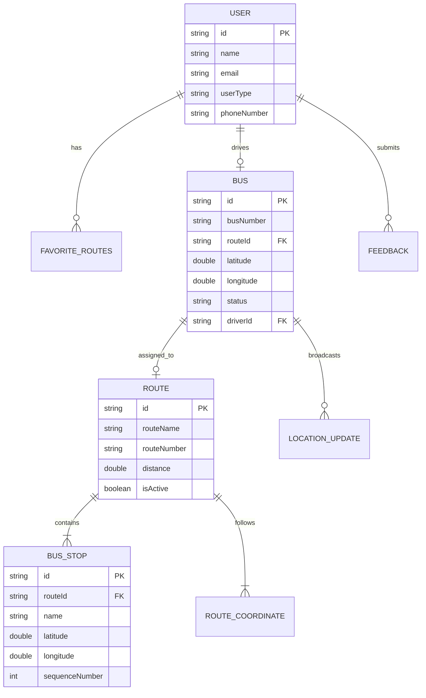

# YatraLive Data Schemas Documentation

## Overview

This document provides comprehensive documentation of all data models used in the YatraLive real-time bus tracking system. The schemas define the structure of data stored in Firebase Realtime Database and exchanged between client applications.

## Table of Contents

- [Core Models](#core-models)
  - [BusModel](#busmodel)
  - [RouteModel](#routemodel)
  - [UserModel](#usermodel)
- [Supporting Models](#supporting-models)
  - [BusStop](#busstop)
  - [RouteLatLng](#routelatlng)
- [Real-time Communication Models](#real-time-communication-models)
  - [DriverMessage](#drivermessage)
  - [PassengerMessage](#passengermessage)
- [Sample JSON Data](#sample-json-data)

---

## Core Models

### BusModel

Represents a bus entity with real-time location and operational data.

| Field | Type | Required | Nullable | Description |
|-------|------|----------|----------|-------------|
| id | String | ✅ | ❌ | Unique bus identifier (e.g., "bus_001") |
| busNumber | String | ✅ | ❌ | Registration number (e.g., "DL-1PC-0101") |
| routeId | String | ❌ | ✅ | Current route assignment |
| latitude | double | ✅ | ❌ | Current GPS latitude (-90 to 90) |
| longitude | double | ✅ | ❌ | Current GPS longitude (-180 to 180) |
| status | String | ✅ | ❌ | Operational status: "active", "inactive", "maintenance" |
| passengerCount | int | ❌ | ✅ | Current passenger count (0-100) |
| driverId | String | ❌ | ✅ | ID of assigned driver |
| lastUpdated | DateTime | ✅ | ❌ | Timestamp of last location update |
| sessionStarted | DateTime | ❌ | ✅ | Driver session start time |
| sessionEnded | DateTime | ❌ | ✅ | Driver session end time |
| speed | double | ❌ | ✅ | Current speed in km/h |
| heading | double | ❌ | ✅ | Direction in degrees (0-360) |

**Validation Rules:**
- `latitude` must be between -90 and 90
- `longitude` must be between -180 and 180
- `status` must be one of: "active", "inactive", "maintenance"
- `passengerCount` must be between 0 and 100
- `heading` must be between 0 and 360

### RouteModel

Defines a bus route with stops and path information.

| Field | Type | Required | Nullable | Description |
|-------|------|----------|----------|-------------|
| id | String | ✅ | ❌ | Unique route identifier |
| routeName | String | ✅ | ❌ | Display name (e.g., "City Center to Airport") |
| routeNumber | String | ✅ | ❌ | Route code (e.g., "A1", "B2") |
| stops | List<BusStop> | ✅ | ❌ | Ordered list of bus stops |
| pathCoordinates | List<RouteLatLng> | ✅ | ❌ | GPS coordinates defining route path |
| distance | double | ✅ | ❌ | Total route distance in kilometers |
| estimatedDuration | Duration | ✅ | ❌ | Expected journey time |
| startPoint | String | ✅ | ❌ | Starting location name |
| endPoint | String | ✅ | ❌ | Ending location name |
| isActive | bool | ✅ | ❌ | Whether route is currently operational |
| schedule | Map<String, dynamic> | ❌ | ✅ | Optional timetable data |

### UserModel

Represents system users (passengers, drivers, administrators).

| Field | Type | Required | Nullable | Description |
|-------|------|----------|----------|-------------|
| id | String | ✅ | ❌ | Unique user identifier |
| name | String | ✅ | ❌ | Full name |
| email | String | ✅ | ❌ | Email address (validated format) |
| phoneNumber | String | ✅ | ❌ | Phone number with country code |
| userType | UserType | ✅ | ❌ | Enum: passenger, driver, admin |
| createdAt | DateTime | ✅ | ❌ | Account creation timestamp |
| lastActive | DateTime | ❌ | ✅ | Last activity timestamp |
| preferences | Map<String, dynamic> | ❌ | ✅ | User preferences |
| profileImageUrl | String | ❌ | ✅ | Profile picture URL |
| **Driver Fields** |
| licenseNumber | String | ❌* | ✅ | Driver's license number (*Required for drivers) |
| busId | String | ❌ | ✅ | Assigned bus ID |
| isOnDuty | bool | ❌ | ✅ | Current duty status |
| **Passenger Fields** |
| favoriteRoutes | List<String> | ❌ | ✅ | List of favorite route IDs |
| notificationPreferences | Map<String, dynamic> | ❌ | ✅ | Notification settings |

**Validation Rules:**
- `email` must match pattern: `/^[A-Za-z0-9+_.-]+@(.+)$/`
- `phoneNumber` must match pattern: `/^[+]?[0-9]{10,15}$/`
- `userType` must be one of: "passenger", "driver", "admin"

---

## Supporting Models

### BusStop

Represents a stop along a bus route.

| Field | Type | Required | Nullable | Description |
|-------|------|----------|----------|-------------|
| id | String | ✅ | ❌ | Unique stop identifier |
| name | String | ✅ | ❌ | Stop name |
| latitude | double | ✅ | ❌ | GPS latitude |
| longitude | double | ✅ | ❌ | GPS longitude |
| sequenceNumber | int | ✅ | ❌ | Order in route (1-based) |
| estimatedArrivalFromStart | Duration | ❌ | ✅ | Expected time from route start |
| isTerminal | bool | ✅ | ❌ | Whether this is a terminal stop |

### RouteLatLng

Represents a GPS coordinate point on a route path.

| Field | Type | Required | Nullable | Description |
|-------|------|----------|----------|-------------|
| latitude | double | ✅ | ❌ | GPS latitude |
| longitude | double | ✅ | ❌ | GPS longitude |

---

## Real-time Communication Models

### DriverMessage

Message broadcast by driver app with location updates.

| Field | Type | Required | Nullable | Description |
|-------|------|----------|----------|-------------|
| messageId | String | ✅ | ❌ | Unique message identifier |
| busId | String | ✅ | ❌ | Broadcasting bus ID |
| routeId | String | ✅ | ❌ | Current route ID |
| driverId | String | ✅ | ❌ | Driver identifier |
| latitude | double | ✅ | ❌ | Current GPS latitude |
| longitude | double | ✅ | ❌ | Current GPS longitude |
| speed | double | ❌ | ✅ | Current speed in km/h |
| heading | double | ❌ | ✅ | Direction in degrees |
| passengerCount | int | ❌ | ✅ | Current passenger count |
| crowdLevel | String | ❌ | ✅ | "low", "medium", "high" |
| timestamp | DateTime | ✅ | ❌ | Message timestamp |
| metadata | Map<String, dynamic> | ❌ | ✅ | Additional data |

### PassengerMessage

Feedback message from passenger app.

| Field | Type | Required | Nullable | Description |
|-------|------|----------|----------|-------------|
| messageId | String | ✅ | ❌ | Unique message identifier |
| passengerId | String | ✅ | ❌ | Passenger identifier |
| busId | String | ❌ | ✅ | Related bus ID |
| routeId | String | ❌ | ✅ | Related route ID |
| type | MessageType | ✅ | ❌ | Message type enum |
| payload | Map<String, dynamic> | ✅ | ❌ | Message data |
| timestamp | DateTime | ✅ | ❌ | Message timestamp |

**MessageType Enum Values:**
- `boarding` - Passenger boarded bus
- `alighting` - Passenger left bus
- `crowdingReport` - Crowding level feedback
- `delayReport` - Delay notification
- `feedback` - General feedback
- `routeSubscribe` - Subscribe to route updates
- `routeUnsubscribe` - Unsubscribe from route

---

## Sample JSON Data

### Bus Entity Example

```json
{
  "bus_001": {
    "busNumber": "DL-1PC-0101",
    "routeId": "route_001",
    "latitude": 28.6139,
    "longitude": 77.2090,
    "status": "active",
    "driverId": "driver_001",
    "passengerCount": 25,
    "speed": 35.5,
    "heading": 45.2,
    "lastUpdated": 1704067200000,
    "sessionStarted": 1704060000000
  }
}
```

### Route Entity Example

```json
{
  "route_001": {
    "routeName": "City Center to Airport",
    "routeNumber": "A1",
    "startPoint": "City Center Bus Stand",
    "endPoint": "Airport Terminal 1",
    "distance": 25.5,
    "estimatedDurationMinutes": 45,
    "isActive": true,
    "pathCoordinates": [
      {"lat": 28.6139, "lng": 77.2090},
      {"lat": 28.6200, "lng": 77.2100},
      {"lat": 28.6250, "lng": 77.2150}
    ],
    "stops": [
      {
        "id": "stop_001",
        "name": "City Center Bus Stand",
        "latitude": 28.6139,
        "longitude": 77.2090,
        "sequenceNumber": 1,
        "estimatedArrivalMinutes": 0,
        "isTerminal": true
      },
      {
        "id": "stop_002",
        "name": "Central Park",
        "latitude": 28.6200,
        "longitude": 77.2100,
        "sequenceNumber": 2,
        "estimatedArrivalMinutes": 8,
        "isTerminal": false
      }
    ]
  }
}
```

### User Entity Example

```json
{
  "user_001": {
    "name": "Rajesh Kumar",
    "email": "rajesh.kumar@example.com",
    "phoneNumber": "+919876543210",
    "userType": "passenger",
    "createdAt": 1704067200000,
    "favoriteRoutes": ["route_001", "route_003"],
    "notificationPreferences": {
      "busArrival": true,
      "delays": true,
      "crowding": false
    }
  }
}
```

### Driver Entity Example

```json
{
  "driver_001": {
    "name": "Amit Singh",
    "email": "amit.singh@transport.gov.in",
    "phoneNumber": "+919876543211",
    "userType": "driver",
    "createdAt": 1704067200000,
    "licenseNumber": "DL-2021-001234",
    "busId": "bus_001",
    "isOnDuty": true
  }
}
```

---

## Data Relationships



---

## Firebase Database Structure

```
yatralive-db/
├── buses/
│   ├── bus_001/
│   ├── bus_002/
│   └── bus_003/
├── routes/
│   ├── route_001/
│   │   └── stops/
│   │       ├── stop_001/
│   │       └── stop_002/
│   └── route_002/
├── users/
│   ├── user_001/
│   └── driver_001/
├── feedback/
│   └── {auto-generated-id}/
└── notifications/
    └── {auto-generated-id}/
```

---

## Version History

| Version | Date | Changes |
|---------|------|---------|
| 1.0.0 | 2025-01-01 | Initial schema definition |
| 1.1.0 | 2025-08-31 | Added real-time communication models |
| 1.2.0 | 2025-08-31 | Enhanced validation rules and relationships |

---

*Last Updated: August 31, 2025*
